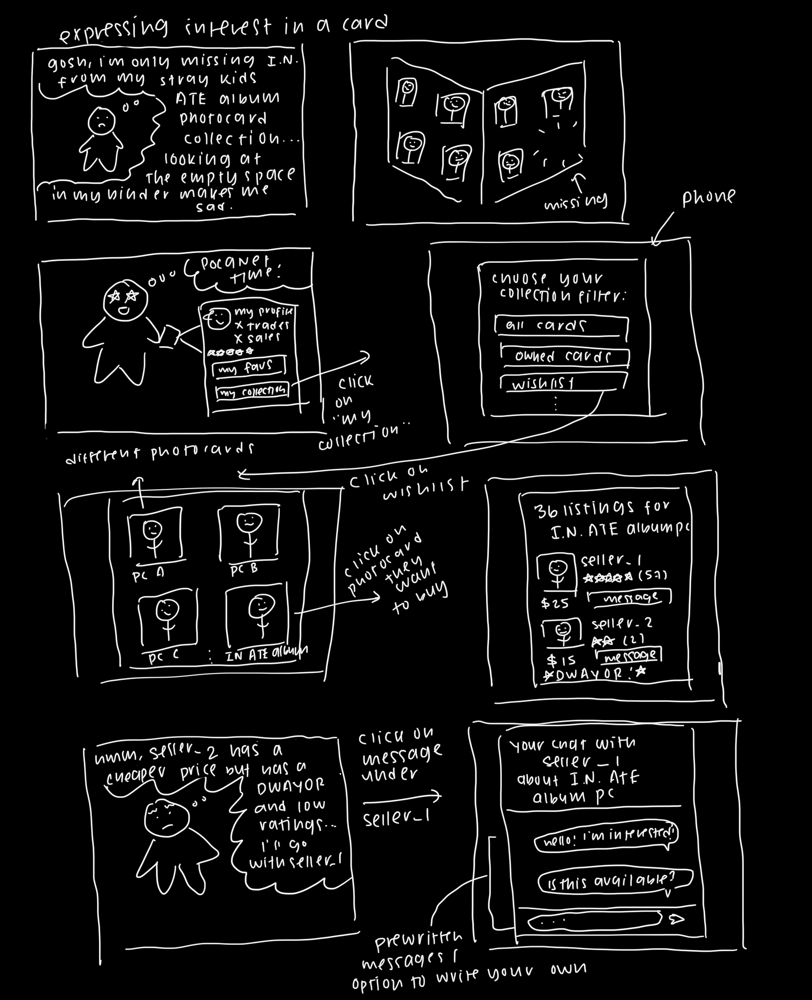
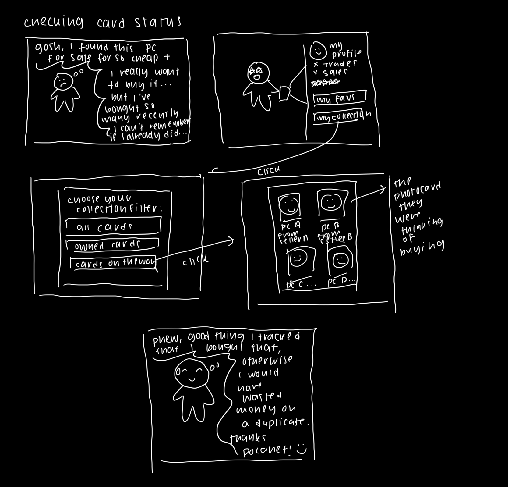

# Assignment 2
[[toc]]

## Broad application goals
### Name
My app will be called Pocanet (poh-cah-net), with the "Poca" part coming from the shorthand collectors use for photocards, and the "net" part representing the web of connections between collectors the app will draw. The "canet" part of the name is also pronounced to sound sort of like "connect", which captures one of the main aims of the app.
### Audience
The intended audience is k-pop collectors, especially those who are looking to make other collector friends.
### Value
Currently, k-pop collector communities form on two different types of existing apps: social media sites like Instagram, X, and Reddit, and marketplaces like Ebay or Mercari. Social media sites serve the purpose of allowing collectors to crowd-source ideal market values of photocards and make collector friends, but searching for specific photocards to buy is difficult and there is a significant risk of getting scammed. Marketplaces solve these problems, but it's difficult to make human connections for those who are interested and sellers often overprice their photocards or sell fakes, requiring buyers to have a high level of knowledge about collecting in order to have a good experience. This app, because it is designed specifically with the aim of catering to the needs of k-pop collectors, will combine the strengths of both pre-existing apps and work to become an all-in-one stop for collectors.

## Scrapbook of comparables
I started by examining different apps/websites that aimed to cater to collectors, then expanded my search to general websites that might have applicable functionality.

This image is from Collector Store, a website that represents the catalog of a physical collectibles store, and demonstrates the feature of filtering anime figurines by what anime they are a part of. Similarly, in my app, I could provide the ability for users to filter by K-pop group and even by specific member in order to improve the search functionality.

This image is from Collectors.com and displays the features of a record of all existing trading cards with information about them, as well as the ability to estimate values for cards. In my application, I could create an option to browse a catalog of all existing photocards by group and even give collectors the option to estimate the value of their entire collection.

This image is from Ebay and shows their detailed seller review page, including metrics like shipping cost, speed, and communication, as well as more specific reviews. In my app, I could easily adapt this feature to include ratings specific to k-pop collection like robustness of packaging protection or whether or not they frequently include cute freebies.

Rare Records, a site for record collectors, offers a price guide that allows users to list their collection and value it. I could expand on this feature by allowing collectors to keep a digital version of their collection and compare it to their goal collection. I could also give them the ability to mark specific cards as on the way, ordered, or not yet shipped, which would make tracking their collection and preventing duplicate card purchases easier.

Spotify's discover weekly algorithm recommends songs based on listeners' previous listening history. I could come up with a similar algorithm to recommend cards that users might be interested based on their current collection (for example, if a card would complete a set) or wishlist.

Strava gamifies exercise by giving uses trophies or achievements, as well as tracking their PRs. I could give users a similar gamified experience by giving them trophies for completing collections or for finding a card for significantly under market value, etc.

Tinder uses the swipe feature to allow users to quickly make judgements about people they'd be willing to date. In my app, I could use the swipe feature to allow users to swipe through available photocards that match their wishlist or recommended photocards, making the process of discovery and expressing interest much more interactive.

## Brainstorming feature ideas
1. **Photocard Archive**: The app features a comprehensive encyclopedia consisting of all existing photocards (starting with a small subset of K-pop groups; more can be added with future updates or by user request), sorted by group, member, and era (album they're associated with). They will also be tagged with the store they're from (most photocards are pre-order benefits that can only be obtained by pre-ordering an album from a certain store or website). Each photocard will have an average market price sourced by scraping data from secondhand websites like Ebay and Mercari, as well as the option to track price change over time.
2. **Collection Tracking**: Users can browse through the encyclopedia and mark all the cards that they own. They can then see the total estimated valuation of their collection.
3. **Card Status Tracking**: Users can mark cards from the encyclopedia as owned (part of their collection), wishlisted, purchased but not shipped, purchased and shipped. They can also set custom tags (for example, marking all cards currently in Korea or purhcased from a certain seller).
4. **Willing to Trade/Sell List**: Users can mark cards they currently have as Willing to Trade and/or Willing to Sell; only then will their profiles be made available to other users that are looking for those cards. That way, users who are not interested in giving up their collection will not be faced with unsolicited messages, and users who only want to sell or only want to trade will not have their time wasted with offers they won't accept.
5. **Recommendations**: Users can opt into being recommended photocards that are similar to the ones in their collection, complete sets that they are close to finishing, or otherwise they might want to purchase.
6. **Swiping/Discovery**: Users will be presented with cards from their wishlist (or, if they opt in, algorithm recommended) one at a time, and can swipe right to send an automated message of interest after which further negotiation can proceed. They can also save cards on their discovery page for later.
7. **Showcase**: Users have the option to display on their profiles their favorite items in their collection, and to upload pictures of those photocards. Often, collectors like to take their photocards around with them as they go about everyday life, and enjoy showing off their favorite idols in ordinary places (for example, they might take pictures of their photocards in holders with their food before eating).
8. **Budgeting/Money Tracking**: Sometimes, collectors get over-zealous about their collections and end up spending more money than they intended to. The app could allow users to set a goal budget (per week, month, year, etc.) that anticipates future purchases (for example, if a new album has been announced, collectors could indicate that they will be purchasing photocards from it and the estimated costs will factor into their budget). The app can also track the amount of money spent on it to give collectors a better idea of their spending habits.
9. **Group Order Management**: To lower the prices of shipping from Korea, collectors often join group orders to divide EMS among many people, and these often involve three payments (the initial cost of the photocard, international shipping, and domestic shipping). The app can provide a functionality to track all currently joined group orders in one place, displaying a list of active group orders and their statuses (collecting orders, paid, shipped to Korean address, shipped to domestic address, collecting addresses to ship to the joiners, etc.). This can prevent users from forgetting about upcoming group order payments and being blindsided by them.
10. **Profile Trophies and Progress Bars**: Users can earn trophies or achievements for completing collections, leaving reviews, trading with many users, getting good reviews, and other forms of desired behavior. They can also display progression bars on their profiles showing how close they are to completing certain collections, providing a sense of progress tracking and a gamification of good behavior on the site.
11. **Seller Kudos**: Some sellers like to decorate their k-pop mail before they send it out, including freebies like stickers, stationary, fake photocards, or even sometimes real photocards. The app could include a way to reward this behavior by allowing buyers to give kudos or awards to sellers who go above and beyond (whether with their packaging, their communicativeness, or the speed of their shipping), which they can display on their profile.
12. **DWAYOR Page**: DWAYOR, or Deal With At Your Own Risk, is the community name for posts made to warn about sellers or traders who are scammers, suspected of being scammers, or generally uncommunicative, rude, or irresponsible. On Pocanet, there could be both a centralized database collecting user-submitted (and mod-verified, to prevent abuse) DWAYORs and the feature to have DWAYORs automatically appear on a seller's profile.
13. **DWAYOR Deprioritization**: Sellers with many DWAYORs can be deprioritized from the discovery page, so that users will be less likely to see the photocards they've put up for sale or trade (think shadowbanning on social media). After a certain amount or a certain severity of DWAYORs, they can be restricted from the site for some time or banned altogether (for example, a full-on scammer might be banned immediately while someone who ships incredibly slowly might just be restricted).
14. **Group-Specific Forums**: Pocanet can achieve its goal of connecting collectors by providing a place for them to post about their collections as conversation-starters, as well as general discussion boards about the groups they enjoy (likely in forum or message board format). On these forums, collectors can discuss topics like how they store or display their collections, find people to go to k-pop events with, etc.
15. **Robust Search Functionality**: Outside of the discovery feature, users can directly look for a certain card on their wishlist by filtering down by group, member, album, and type of photocard (album photocard, pre-order benefit, event photocard, broadcast photocard, etc.). However, if the user doesn't know all this information they can either reverse image search if they have a picture of the photocard, or they can browse the encyclopedia and look for it visually. Search results will display all sellers and traders that have marked that photocard as available on their profiles.
16. **K-Pop Event Calendar**: Often, people will host local k-pop trading meetups or events for their favorite members' birthdays. Pocanet can allow users to input their city or town and display events nearby, as well as provide the option for users to upload their own events.
17. **Collection Drop**: Collectors will sometimes try to drop their entire collections quickly if they encounter financial difficulties in their lives. To enable this, there could be a feature that highlights people who are trying to make quick money and who would like to sell in bulk at a very discounted rate to increase the chances of them being able to drop their collections quickly.
18. **Condition Grading System**: To avoid disputes over the condition of a photocard, there could be a unified condition grading system that all sellers/traders must evaluate their photocards by before being allowed to list them. In the event of a dispute, the seller would be required to provide a video of the card's condition with flash for moderators to verify that they were telling the truth.
19. **Group Activity Notifications**: Users can sign up to be notified when a new photocard, album, or collaboration from their favorite group is announced. That way, completionists won't have to constantly check for news and can be assured that they will know when there's something new to add to their collection.
20. **Photocard Availability Trends**: For each photocard, users can see the history of its availability on the site as well as its average price. This can help them make more informed purchasing decisions, because some photocards grow in value over time while others decrease in value.

## VSD analysis
1. With any social media app, there is the very real risk of bad actors looking to connect with children in particular. Especially because the k-pop collecting community tends to skew very young, the direct stakeholders (users of the app) could be negatively impacted by non-targeted use from those who are looking to take advantage of the app's ability to create connections among people. The risk is even more pronounced because people are more likely to trust those with shared interests or hobbies, and the app also proposes a feature to allow users to upload their own trading or otherwise k-pop related events (K-Pop Event Calendar). As such, strong moderation of such events is necessary. Not only would moderators have to review each event before it was published to the public (to ensure that the proposed location is legitimate), the users uploading the event might also have to give proof of identification or some other form of proof that they actually did intend to hold the event (such as permission from the cafe at which they intend to hold it, etc.).
2. In terms of values and environmental sustainability, the feature of rewarding sellers for elaborate packaging (Seller Kudos) could inadvertently encourage overconsumption, as many sellers buy their packing supplies from environmentally devastating websites like Temu or Shein. In order to counteract this effect, there could also be trophies or awards for reusing packaging or otherwise trying to minimize wastefulness. The app could also provide resources for sellers to learn how to DIY their packaging using materials they already have at home, which would save them money as well. This would foster a culture of conservation and reusing among the users of Pocanet.
3. There exists a degree of value tension between protecting buyers from being scammed and protecting sellers from malicious buyers. The DWAYOR Page and DWAYOR Deprioritization features run the risk of sellers being subject to the whims of buyers (for example, if a seller is shadowbanned because they didn't ship as quickly as a buyer wanted them to, or because they weren't willing to give a buyer a discount on a photocard). In order to combat the potential for abuse of the DWAYOR system, Pocanet should set transparent guidelines for what constitutes an offense worthy of a DWAYOR and allow sellers to appeal DWAYORs they feel are unfair. Furthermore, in order to give sellers some recourse against nasty or rude buyers, or buyers who promise to pay but end up wasting the seller's time, DWAYORs can be mutual with sellers also able to make them against buyers.
4. In terms of pervasiveness, if the app becomes widespread among k-pop collectors there is the potential of the app's valuation of photocards (Price Tracking and Photocard Availability Trends features) dictating the market, and not the other way around. There is also the possibility of a negative feedback loop where sellers on other sites set their prices lower and lower in order to compete with the sellers on Pocanet, with the site's valuation decreasing in turn, resulting in massive deflation. Collectors would not be very happy to have their collections suddenly massively drop in value. In order to combat this, Pocanet could make sure to be very transparent with users about how price data is collected and potentially introduce expert (and crowd-sourced from users) opinion to keep the price valuation in a stable state.
5. Finally, there could be an issue with the user experience of values. While in the design process, the discovery or swiping feature is intended to streamline the process of discovering and buying photocards, the impermanence of only seeing one card at a time might cause a feeling of FOMO or of an urgency to buy in users, encouraging overconsumption and buying before thinking. Two features that might address this could be first, if the user has set a budget, showing the user how the projected price matches up with their budget before their message to the seller goes through; second, giving users the ability to scroll through their previously seen cards and go back to them or save them for later, reducing the feeling that they have to buy now or they'll never be able to again.

## Storyboarding and sketching
### Storyboard 1: Expressing interest in a card

### Storyboard 2: Checking card status
